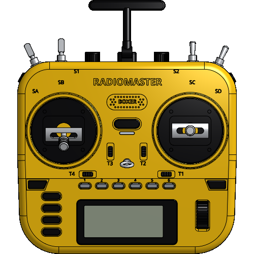
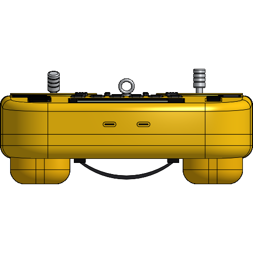
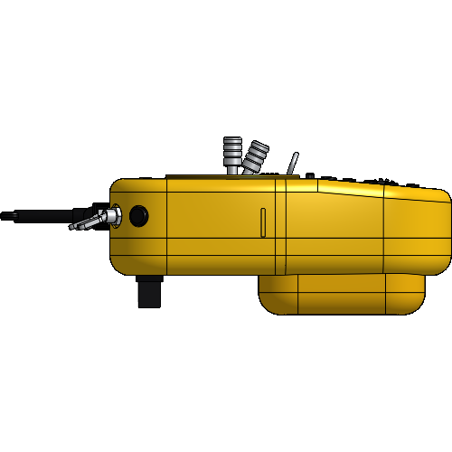

# RadioMaster Boxer – posable Onshape model

`radiomaster_boxer.fs` is a single FeatureScript feature that builds a yellow RadioMaster Boxer
transmitter as 60 named parts. Every switch, button, stick, trim, pot, wheel and the antenna is a
separate part that the feature dialog can pose.

**Onshape:** [Part Studio (workspace `create_geometry_RadioMaster Boxer_285da7c1`)](https://cad.onshape.com/documents/e19a4be3d935b3ed25d9fa94/w/86990f70f6c37f73afba0fa1/e/8fb820af7d6729fd3708e76b),
with the source in Feature Studio `b12a86a78e2864fbdf05bb52` in the same workspace.

Renders are from the first build, before the 0.5 mm floor was added under each gimbal clearance bore.

| Front | Bottom | Left side |
|---|---|---|
|  |  |  |

## Controls (feature parameters)

| Group | Parameter | Motion |
|---|---|---|
| Gimbals (mode 2) | left X / Y, right X / Y | ±25° about the gimbal pivot. The yoke follows the Y axis and the stick follows both. Throttle defaults to low. |
| Switches | SA, SD (2-pos), SB, SC (3-pos) | lever rocks ±20° front/back on its bushing pivot |
| | SE latched, SF held | low-profile corner buttons with 0.8 mm travel |
| | S1, S2 | knurled pot knobs, ±150° |
| Trims & buttons | T1–T4 | rockers ±10° (T2/T3 vertical, T1/T4 horizontal) |
| | Pressed button | one of Power, SYS, MDL, RTN, PAGE <, PAGE >, TELE, 1–6, wheel; 0.8 mm plunge |
| | Scroll wheel | free rotation about its axle (24 ribs) |
| Antenna & extras | fold 0–90°, swivel ±90° | T-paddle antenna on a clevis hinge |
| | Lanyard ring lift, engraved labels | |

Each moving part has a mate connector at its pivot (Z axis = motion axis). The Front Shell has
a matching connector at the same place. To drive the controls interactively, insert the Part
Studio into an Assembly and connect each pair with a Revolute mate (Slider for buttons), or use
Revolute + Revolute for the sticks.

## Geometry

* Frame: +X right, +Y toward the antenna, +Z out of the front face. The upper front panel is Z = 0.
* Shell: 178 × 156 mm front outline (R26 top corners, R32 bottom corners, slight taper below the
  waist) and 44 mm deep. The lower screen panel folds back 5° at Y = −17. It is split into
  Front Shell and Rear Shell at Z = −27.
* Overall envelope with the antenna up, grips and sticks: about 178 × 206 × 81 mm. The published
  spec is 235 × 178 × 77 mm.
* The front layout was measured from RadioMaster's product render and scaled to the 178 mm width.
* Every recess is cut in one boolean, so the shell history stays short. All construction sketches
  are deleted at the end.
* A stress pose (sticks in opposite corners, all levers thrown, trims deflected, antenna folded)
  was checked with `evCollision`: no part interferes with another.

## Known approximations

* The shells are solid (not hollowed) and have no internals: PCB, gimbal springs, Hall sensors.
* Back-side details (JR bay, battery door, strap, grips) and the USB-C and SD port positions are
  plausible placements. They were not measured from drawings.
* SE/SF are placed as low-profile buttons on the top-corner shoulders, based on RadioMaster's
  description. Exact shape and position are approximate.
* Knurling is shown as flutes and grooves, not a true diamond knurl.
